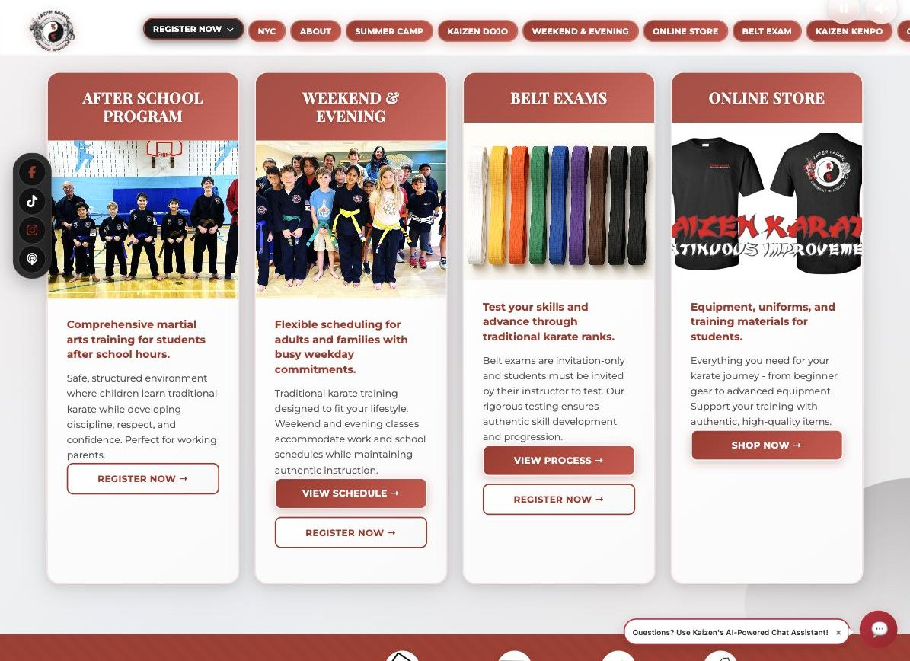

# Kaizen Karate Content Platform

[](https://github.com/shanewin/kaizen-karate/actions/workflows/ci.yml)

Production website, admin CMS, and AI assistant for a martial arts organisation
running around 60 after school programs across Washington DC, Maryland,
Northern Virginia, and New York, alongside summer camps, a dojo and belt
examinations. Live at [kaizenkarateusa.com](https://kaizenkarateusa.com).



**The core idea:** one JSON knowledge base is the single source of truth for the
website, the AI assistant, and the operational reporting. Content is authored
once, and everything downstream is derived from it. There is no second store to
keep in sync and no ETL step between the CMS and the AI layer.

```
                        +-----------------------------+
   Staff edit content   |   admin/  (CMS)             |
                 --->   |   draft -> review -> publish|
                        +--------------+--------------+
                                       | writes
                                       v
                    +--------------------------------------+
                    |   data/content/site-content.json     |  <-- single source
                    |   16 sections, 231 KB, versioned     |      of truth
                    +---+------------------------------+---+
                        |                              |
              renders   |                              |  projected on publish
                        v                              v
        +-----------------------------+   +------------------------------+
        | includes/content-loader.php |   | data/content/topics/*.json   |
        |   the public website        |   |   7 topic-scoped slices      |
        +-----------------------------+   +---------------+--------------+
                                                          | retrieval
                                                          v
                                          +------------------------------+
                                          | chatbot-php/                 |
                                          | SmartDataLoader -> Claude    |
                                          +------------------------------+
```

## Why this design

The same facts have to appear in two places: on the page a visitor reads, and in
the context the assistant answers from. Content here is edited by staff rather
than engineers, so any design that depends on someone remembering to update the
second place will drift.

That rules out the conventional approach of a CMS database plus a separate
vector store filled by a nightly sync. Two stores means two states, and the gap
between them is exactly where an assistant starts quoting last season's prices
to a parent. So the retrieval corpus is not a copy. It is a *projection*,
regenerated from the source on every publish and never edited by hand.

### Retrieval: topic routing rather than embeddings

`chatbot-php/SmartDataLoader.php` matches an incoming question against topic
keywords, then formats only the relevant slices into the model's context.

This is deliberately not vector search. At this corpus size, seven topic files
totalling roughly 125 KB, an embedding index would add a second store to keep in
sync, which is the exact failure mode the architecture exists to avoid. Keyword
routing is inspectable, needs no build step, and costs nothing to keep current.
It replaced an approach that loaded the entire knowledge base on every turn and
was triggering API rate limits.

Measured input cost per question, before and after the projection work:

| Question | Loads | Before | After |
|---|---|---|---|
| "what belt exams do you have" | `general` + `belt_exams` | 15,248 tok | **7,528 tok** |
| "what is your refund policy" | `general` + `policies` | *unanswerable* | 4,882 tok |
| "where are you located" | `general` + `locations` | *unanswerable* | 3,429 tok |
| "what are your hours" | `general` | 3,205 tok | 3,205 tok |

The belt exam halving comes from pruning `lightbox_content`, roughly 104 KB of
rendered curriculum HTML that the website needs and the model does not. The two
previously unanswerable questions were content the site published but no topic
file exposed. The projector's coverage check now makes that class of gap
impossible to ship unnoticed.

### The invariant, and how it is enforced

Derived data rots the moment someone edits it by hand. When this work began,
four of the five topic files had already drifted from the source, and the
assistant was answering from stale content.

Three things prevent that now:

1. Publishing regenerates every topic file as part of the same action, so the
   corpus cannot lag the site.
2. `scripts/generate-topics.php --check` projects into a scratch directory and
   exits non-zero if the committed output differs. Drift becomes a build
   failure rather than a support ticket.
3. `TopicProjector::verifyCoverage()` reports any content section that no topic
   exposes, catching "the assistant cannot answer about the thing we just added"
   at publish time.

## Protecting a paid endpoint

Every assistant request costs money, so `chatbot-php/chat-api.php` refuses work
before it reaches the model rather than after. Two independent checks:

- **Origin allowlist.** Stops other sites embedding the widget and billing this
  account. A rejected origin is refused server side, so it costs nothing.
- **Sliding window rate limit.** The check that actually caps spend, since a
  script posting directly sends no `Origin` header at all. 50 requests per hour
  per caller, with `X-RateLimit-*` headers and `Retry-After` on a 429.

Reads and writes to the limiter's store take an exclusive lock. Without one, two
overlapping requests lose an increment, so the limit could be exceeded under
exactly the concurrent load it exists to contain. A test drives eight concurrent
writers and asserts all 80 increments survive. Identifiers are hashed, so the
store holds no raw IP addresses, and if the store is unwritable the limiter
fails open rather than taking the assistant offline.

## Operational reporting

Because the knowledge base and the captured leads are both plain files on the
same host, reporting reads them directly. No warehouse, no extract step.

`admin/submissions.php` aggregates enquiries captured by `form-handler.php`
together with the acquisition channel the forms record, so staff can see enquiry
volume and where it came from next to the content they are editing. It is a
modest reporting surface by design. The point is that it needed no
infrastructure beyond what already existed.

## Page structure

`index.php` was a 4,672 line, 270 KB monolith carrying every homepage section
plus 700 lines of inline CSS and roughly 700 lines of inline JavaScript. It is
now a 332 line page shell: the `<head>`, the nav include, fourteen section
includes, and the script tags.

The sections live in `sections/home/`, the styling in `styles/home.css`, and the
behaviour in `scripts/home/`, following the pattern the other pages already
used. Each extraction was verified by rendering the homepage and diffing against
a byte exact baseline, with `time()` based cache busters normalised so renders
compare deterministically. Every one was byte identical.

A few small blocks stay inline on purpose: the analytics snippet, the chat
widget config that must run before the widget loads, and two short handlers
whose extraction would only add indirection.

`testing.php` is the staff preview of unpublished edits. It used to be a 4,904
line copy of `index.php`, kept in step by hand, and it had drifted far enough
that the preview no longer resembled the live site. It is now 45 lines: it
authenticates, points the content layer at the draft files, and includes
`index.php`. One homepage template, rendered twice against different content,
which is the same idea the chatbot corpus uses.

## URLs and routing

`.htaccess` owns routing. Page templates live in `pages/` and `belts/`, but
nothing in the URL reflects that: clean URLs such as `/about` map to
`pages/about.php`, and every relocated file also keeps its original `.php`
address, so an older link like `/faq.php` still resolves. That is 28 relocation
rules alongside the clean URL rules, generated from the directories themselves
rather than maintained by hand.

The tradeoff is that the file layout is free to change without any URL changing,
but the routing rules have to travel with the files.

## Repository layout

| Path | Role |
|---|---|
| `data/content/site-content.json` | Source of truth, 16 content sections |
| `data/content/topics/` | Derived retrieval corpus (generated, do not edit) |
| `includes/TopicProjector.php` | Projection: source to topic slices, with pruning and coverage checks |
| `includes/content-loader.php` | Renders site sections from the knowledge base |
| `admin/` | CMS: draft, publish, backup, with a change log |
| `admin/error-handling.php` | Logs PHP errors instead of printing them into admin pages |
| `chatbot-php/` | Retrieval, Claude API integration, embeddable widget |
| `chatbot-php/RateLimiter.php` | Sliding window spend guard on the chat endpoint |
| `scripts/generate-topics.php` | CLI projector, with a `--check` mode for CI |
| `testing.php` | Staff preview: renders `index.php` against draft content |
| `pages/`, `belts/` | Page templates, served at clean URLs via `.htaccess` |
| `sections/`, `sections/home/` | Page sections, including the homepage's own |
| `modules/nyc/` | Second location module |
| `tests/` | Unit tests for the projection invariant and the rate limiter |

## Running locally

Requires PHP 8.0 or newer, and Composer.

```bash
composer install

cp admin/config.example.php admin/config.php
cp chatbot-php/config.example.php chatbot-php/config.php
cp chatbot-php/.env.example chatbot-php/.env    # add your Anthropic API key

# Admin credentials are bcrypt hashes supplied through the environment:
export KAIZEN_ADMIN_HASH="$(php -r "echo password_hash('choose-a-password', PASSWORD_DEFAULT);")"

php scripts/generate-topics.php     # build the retrieval corpus
php tests/TopicProjectorTest.php    # 13 assertions
php tests/RateLimiterTest.php       # 14 assertions
php -S localhost:8000
```

CI lints every PHP file, validates the content JSON, runs both test suites,
verifies the chatbot corpus is in sync with the site content, and fails the
build if a credential or a captured PII file is ever committed.

### What is not in this repository

- **`assets/videos/` and `assets/images/gallery/`**, roughly 2.6 GB of
  production media, excluded to keep the repository cloneable. Page structure
  renders without them.
- **Captured form submissions**, which are real customer enquiries, excluded
  permanently.
- **`admin/config.php` and `chatbot-php/.env`**, which hold credentials.
  `.example` templates are tracked in their place.

## Known limitations

An honest account of what a reviewer will find.

- **Flat file storage** for captured enquiries and rate limiting. Enquiries
  arrive at a rate flat files handle comfortably, roughly 4,500 records to date,
  and storing them this way is what makes the reporting need no extract step.
  Every read modify write now runs under an exclusive lock, so entries are not
  lost when submissions overlap, but the model is still a file on one host and
  would not survive being written to from more than one.
- **Retrieval is keyword routed**, so a question phrased entirely outside a
  topic's vocabulary falls back to general content. Fine for a bounded FAQ
  domain. It would not survive an open corpus.
- **The origin allowlist cannot stop a non browser client.** A script posting
  directly sends no `Origin` header at all, which is why the rate limit, rather
  than the allowlist, is what actually caps spend.

## License

Source published as a portfolio reference. Kaizen Karate brand assets and
content are not licensed for reuse.
